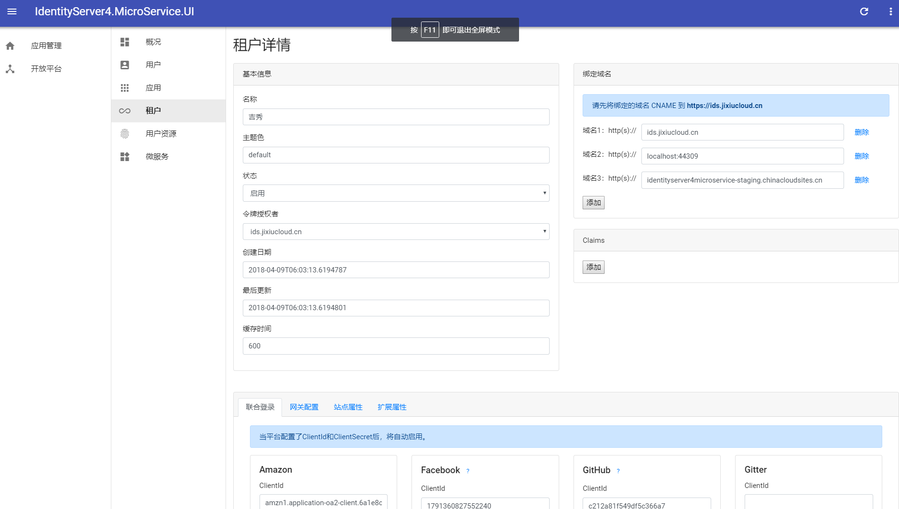

# IdentityServer4.MicroService.UI





```javascript
# rebuild base configuration normally you changed the identityserver url
- npm run app.build

# rebuild identityserver ui if you need custom UI
- npm run identityserver.build
```
