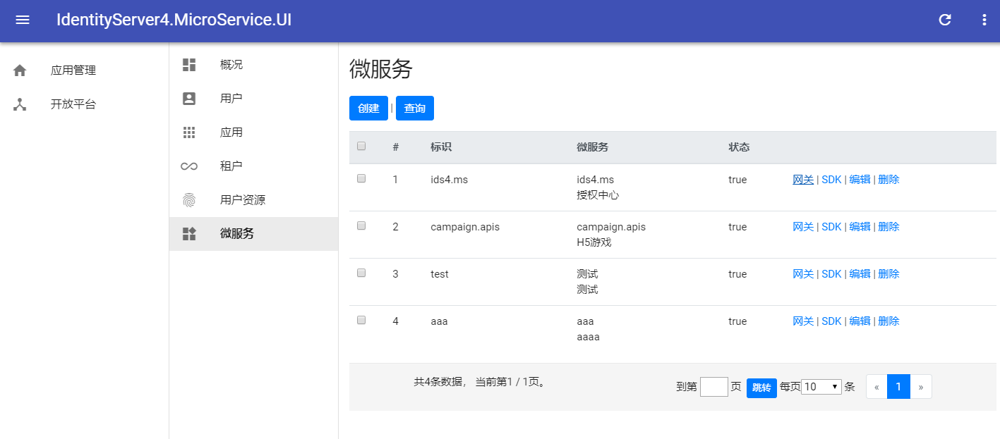

# IdentityServer4.MicroService.UI


[](https://www.npmjs.com/package/identityserver4.microservice.ui)


## Quick start

- Run IdentityServer4.Microservice (get the server url https://localhost:44309)
- Run IdentityServer4.MicroService.UI (server will be https://localhost:44386)


截图





```javascript
# rebuild base configuration normally you changed the identityserver url
- npm run app.build

# rebuild identityserver ui if you need custom UI
- npm run identityserver.build
```